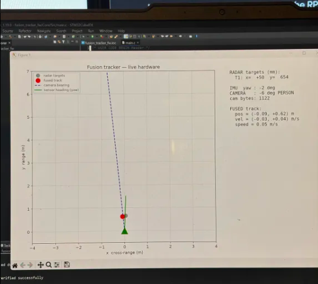
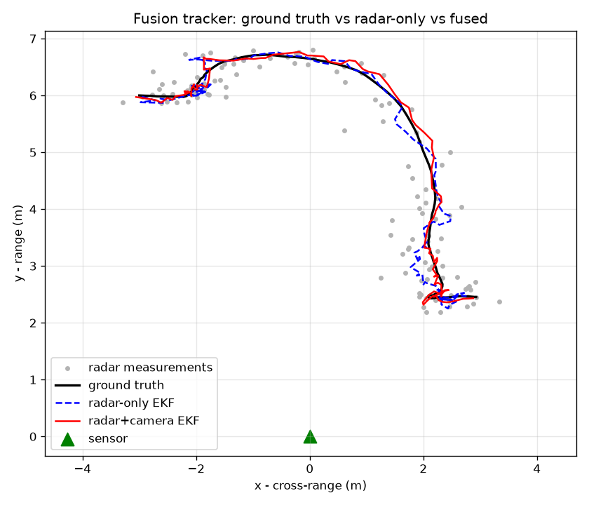
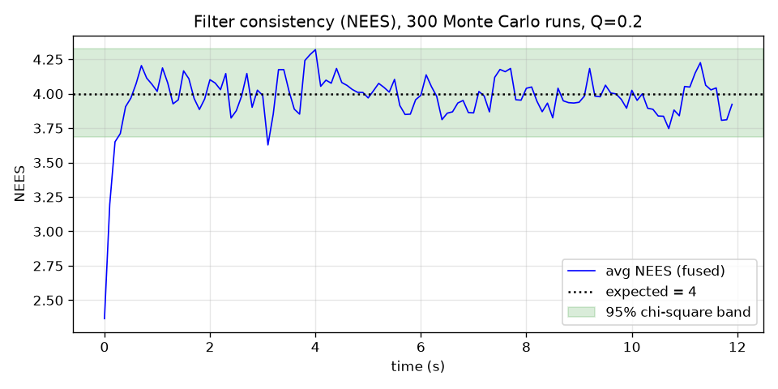
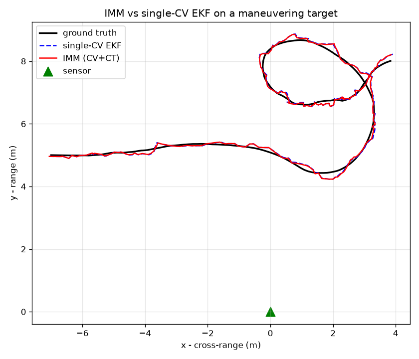
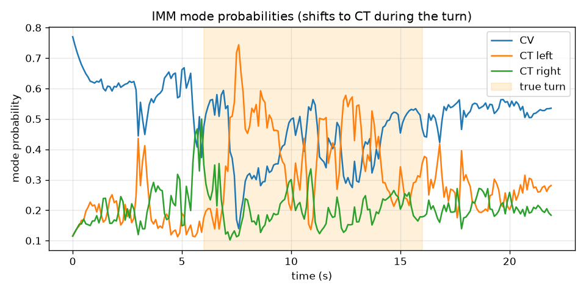
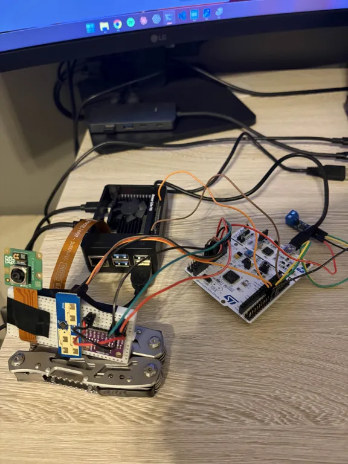

# Multi-Sensor Fusion Tracker

**Real-time perception on bare-metal embedded hardware.** A 24 GHz radar, a camera (YOLOv8), and a
9-DOF IMU are fused by a **hand-written Extended Kalman Filter running on an STM32F446RE** (bare-metal
C, no RTOS, deterministic super-loop). Fused tracks are broadcast over **CAN 2.0B** and streamed to a
live dashboard.

-00599C)


> Portfolio project for perception / autonomy / embedded roles in **defense, aerospace, and robotics.**
> The contribution is the **fusion layer** — a hand-written EKF/IMM, cross-modal (radar↔camera)
> measurement fusion, IMU frame stabilization, clutter rejection, statistical validation, and CAN
> output. The radar module does its own low-level detection; this project does **not** claim to
> reinvent that (see [Honest scope](#honest-scope) below).

<p align="center">
  
  <br>
  <em>Live hardware run — grey: raw radar targets · <b>red: fused EKF track</b> · blue: camera bearing to
  the detected person · green: IMU heading. The fused track holds the target while rejecting radar clutter.</em>
</p>

---

## Highlights

- **Hand-written EKF in C** — a 4-state constant-velocity filter (`px, py, vx, vy`) with the full
  predict/update matrix math written from scratch (no linear-algebra library), running on the MCU.
- **Genuinely nonlinear fusion** — the radar gives a *linear* Cartesian position update; the camera
  gives a *nonlinear bearing-only* update (`h = atan2`), which is what makes it a true EKF and not a
  plain Kalman filter.
- **35% more accurate than radar alone** — fusing the camera bearing cuts position RMSE from
  **0.218 m → 0.141 m** in simulation (see [Validation](#validation--results)).
- **Statistically consistent** — the filter passes **NEES/NIS** chi-square consistency tests
  (NEES mean 3.99 vs. 4.0 expected, 99% in-bounds) — the standard defense/aerospace way to prove a
  filter is correctly tuned, not just "looks good."
- **IMM for maneuvering targets** — an Interacting-Multiple-Model filter (constant-velocity +
  coordinated-turn) is **13% more accurate through turns** than a single CV model.
- **Clutter rejection** — nearest-neighbor gating rejects radar ghosts / multipath so the track locks
  onto the real target instead of jumping to false alarms.
- **Robust real-time I/O** — DMA + idle-line UART with automatic overrun-error recovery, so a single
  line-noise glitch can't permanently stall a sensor link.
- **Full stack, owned end to end** — firmware, ML detection, comms protocol, CAN, Python validation,
  and a live visualization dashboard.

---

## Architecture

```
   Radar  HLK-LD2450    ──UART──►┐
   (Cartesian x,y,speed)         │
                                 │   ┌─────────────────────────────┐
   IMU    BNO085 (UART-RVC) ─────┼──►│        STM32F446RE           │──► CAN 2.0B  (fused track state)
   (yaw → world-frame rotation)  │   │      bare-metal C, no RTOS   │
                                 │   │  • hand-written EKF / IMM     │──► VCP telemetry ──► live dashboard
   Camera Pi Cam 3               │   │  • NN gating + track mgmt     │        (host PC, matplotlib)
   ─► YOLOv8-n (Raspberry Pi 5) ─┘   └─────────────────────────────┘
   (person bearing, over UART)
```

- **Radar** → Cartesian target positions → **linear** position measurement.
- **Camera** → bearing-only person detections (`atan2` measurement model) → **nonlinear** update.
- **IMU** → yaw rotates every measurement into a **stabilized world frame** (zeroed at startup) so the
  rig can pan without smearing the track.

---

## How the fusion works

**Prediction (constant velocity).** Each step the state is propagated `x = Fx`, `P = FPFᵀ + Q`, with
`Q` from a continuous white-noise-acceleration model. Process-noise density `Q_DENSITY` was tuned in
the sim against NEES/NIS, not by eyeball.

**Radar update (linear).** The LD2450 reports up to 3 targets as Cartesian `(x, y)`. Each is rotated
by the (startup-zeroed) IMU yaw into the world frame and applied as a standard linear position update.
The 2×2 innovation-covariance inverse is written out in closed form.

**Camera update (nonlinear → EKF).** YOLOv8-n on the Pi detects a person and reports its **bearing**.
The measurement model `h(x) = atan2(px, py)` is nonlinear, so it's linearized on the fly
(`H = [∂h/∂px, ∂h/∂py]`) — this is the defining feature of an *extended* KF. Innovations are wrapped to
`[-π, π]` so the ±180° seam doesn't blow up the update.

**Data association / clutter rejection.** Rather than blindly trusting radar slot 0, the filter picks
the valid target **nearest its own prediction** within a gate (`GATE_M2`). Ghosts and multipath that
fall outside the gate are ignored, and the track coasts through short dropouts before being deleted.

**IMM (in sim, `sim/imm.py`).** Two models (constant-velocity + coordinated-turn) run in parallel with
Markov mode-switching; the mixed estimate handles both straight-line and turning motion, beating a
single model through maneuvers.

---

## Validation & Results

Everything below is reproducible: `python sim/run_fusion.py` and `python sim/run_imm.py`.

| Metric | Result | Meaning |
|---|---|---|
| Position RMSE, radar-only | **0.218 m** | baseline |
| Position RMSE, radar + camera | **0.141 m** | **35.3% better** with fusion |
| NEES (steady state) | **3.99** (expect 4.0), 99% in bounds | filter is statistically consistent |
| NIS (steady state) | **2.00** (expect 2.0), 98% in bounds | innovations are consistent |
| IMM vs. single-CV, in turns | **0.123 m vs. 0.142 m** | **13% better** through maneuvers |

### EKF fusion — trajectory & consistency

| Fused vs. radar-only track | NEES/NIS consistency |
|:--:|:--:|
|  |  |

### IMM — maneuvering target

| CV + coordinated-turn track | Mode probabilities |
|:--:|:--:|
|  |  |

> **Why NEES/NIS?** In defense/aerospace a Kalman filter isn't "done" when the plot looks smooth — it's
> done when the estimator is *consistent*: its reported covariance actually matches its real error.
> NEES (vs. ground truth, in sim) and NIS (from live innovations) are the standard chi-square tests for
> that. Passing them is the difference between a demo and a filter you'd trust in a tracker.

---

## Engineering highlights

These are the problems that were actually hard — the parts an interviewer will dig into.

- **EKF matrix math by hand, on an M4.** No BLAS, no Eigen. The 4×4 predict and the linear/nonlinear
  updates are written explicitly, exploiting the sparsity of `F`, `H`, and `Q` — cheap enough to run in
  the real-time loop with headroom. See [`firmware/.../Core/Src/fusion.c`](firmware/fusion_tracker_fw/Core/Src/fusion.c).
- **DMA idle-line UART with overrun recovery.** All three serial links use `ReceiveToIdle_DMA` so
  variable-length frames arrive without polling. A subtle HAL trap: after a single overrun/noise event
  the DMA RX **stalls forever** unless the error is explicitly cleared — fixed with
  `AbortReceive` + `__HAL_UART_CLEAR_OREFLAG` + re-arm in the error ISR.
- **Binary frame parsers from datasheets.** Header-synced, checksum-validated state machines for the
  LD2450 30-byte frame (sign-magnitude Cartesian encoding) and the BNO085 UART-RVC 19-byte frame — plus
  an integer `isqrt` to keep libm out of the hot path.
- **IMU frame stabilization + startup zeroing.** The BNO085 reports an *absolute* heading; zeroing it
  to the boot orientation aligns the fused world frame with the sensor so the track sits on the target
  and doesn't swing with the sensor's arbitrary reference.
- **Cross-modal alignment.** Camera pixel-column → bearing (calibrated HFOV), sign-matched to the
  radar's coordinate convention, then rotated into the shared world frame.
- **Deterministic super-loop, not an RTOS.** A timer-driven loop keeps the fusion cadence predictable
  and the timing easy to reason about — appropriate for a hard-real-time estimator.

---

## Repository layout

```
fusion-tracker/
├── firmware/     STM32CubeIDE project (F446RE): fusion.c (EKF), ld2450.c, bno085.c,
│                 camera_link.c, can_bus.c, main.c super-loop + telemetry
├── sim/          Python EKF/IMM sandbox — synthetic trajectories, NEES/NIS validation, plots
├── pi_app/       Raspberry Pi 5: YOLOv8 detection, pixel→bearing projection, serial protocol
├── dashboard/    Live host-PC dashboard (matplotlib): radar dots, fused track, camera ray, IMU heading
├── docs/         Spec, requirements + verification matrix, pinouts, part datasheet images
└── SETUP.md      Toolchain / bring-up checklist
```

---

## Hardware

| Part | Role |
|---|---|
| ST **NUCLEO-F446RE** (Cortex-M4 @ 180 MHz) | fusion compute |
| **HLK-LD2450** 24 GHz radar | Cartesian target tracking (≤3 targets, 10 Hz) |
| **BNO085** 9-DOF IMU (UART-RVC) | yaw / world-frame stabilization |
| **Raspberry Pi 5** + **Camera Module 3** | YOLOv8-n person detection → bearing |
| **SN65HVD230** ×2 CAN transceivers | CAN 2.0B bus + 120 Ω termination |

<p align="center">
  
  <br>
  <em>Bench bring-up: Pi Camera Module 3, LD2450 radar + BNO085 IMU on the breadboard, Raspberry Pi 5,
  and the NUCLEO-F446RE.</em>
</p>

---

## Build & run

**Firmware** — open `firmware/fusion_tracker_fw` in STM32CubeIDE, Build, and Run (flash) to the
NUCLEO-F446RE. Telemetry streams over the ST-LINK virtual COM port at 10 Hz.

**Simulation / validation** (Windows PowerShell):
```powershell
python -m venv .venv; .\.venv\Scripts\Activate.ps1
pip install -r sim\requirements.txt
python sim\run_fusion.py     # radar-vs-fused RMSE + NEES/NIS  -> sim\trajectory.png, sim\nees.png
python sim\run_imm.py        # IMM vs single-CV in a turn      -> sim\imm_*.png
```

**Raspberry Pi** (detection → STM32):
```bash
python3 detect_and_send.py /dev/ttyAMA0     # YOLOv8-n person bearing over the GPIO UART
```

**Live dashboard** (host PC, STM32 on USB):
```powershell
.\.venv\Scripts\python.exe dashboard\live_dashboard.py COM5
```

---

## Requirements & V&V traceability

Requirements are tracked defense-style with an explicit verification method and evidence per line —
see [`docs/requirements.md`](docs/requirements.md). Full design rationale, pinout, coordinate frames,
and CAN message definitions are in [`docs/fusion-tracker-project-spec.md`](docs/fusion-tracker-project-spec.md).

<a name="honest-scope"></a>
## Honest scope

The HLK-LD2450 performs its **own** on-board detection and tracking and outputs Cartesian target
positions — this project does not implement radar signal processing (CFAR/clustering). The engineering
value here is the **fusion and estimation layer**: the hand-written EKF/IMM, cross-modal radar↔camera
association, IMU frame stabilization, clutter gating, statistical validation, and CAN integration. A
documented stretch goal is to swap in a raw-point-cloud radar (TI IWRL6432) and write detection from
scratch. Being explicit about this boundary is deliberate — overclaiming is the fastest way to lose an
interviewer's trust.

---

## Skills demonstrated

Bare-metal C · Kalman filtering (EKF/IMM) · sensor fusion · state estimation & filter consistency
(NEES/NIS) · STM32 HAL / DMA / interrupts · UART/I2C/CAN · real-time systems · binary protocol design ·
computer vision (YOLOv8) · Python/NumPy modeling · systems integration & V&V.

## License

MIT — see [`LICENSE`](LICENSE).
